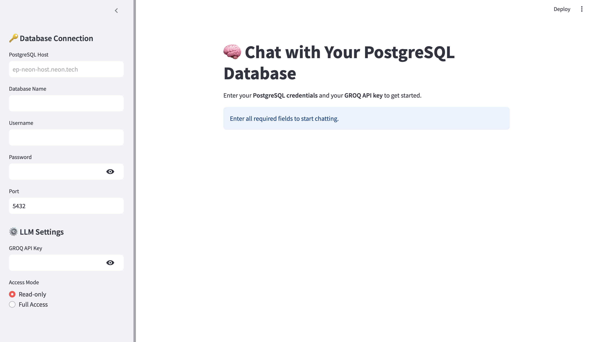

# 📊 ChatSQL: Conversational SQL Assistant

A Streamlit-based app that lets you **chat with your database** using natural language! Ask questions like _"Show me all students with grades above 90"_ and watch it convert your prompt into SQL, execute it, and return results — instantly and beautifully.

Built for ease-of-use, learning, and real-time querying — ideal for beginners, educators, and data professionals.

---

## ✨ Features

- 💬 Chat Interface for SQL queries
- 🤖 LLM-Powered prompt-to-SQL conversion
- 🧠 Remembers query history
- 🛠️ Connects to your SQLite database
- 📁 Clean UI with Streamlit

---

## 🖼️ Demo



---

## 🚀 Installation

### 1. Clone the Repository
```bash
git clone https://github.com/your-username/chat-sql.git
cd chat-sql
```

### 2. Create a Virtual Environment (Optional but recommended)
```bash
python -m venv .venv
source .venv/bin/activate  # On Windows: .venv\Scripts\activate
```

### 3. Install Requirements
```bash
pip install -r requirements.txt
```

### 4. Add Your SQLite Database
Make sure your SQLite file (e.g., `student.db`) is present in the root directory, or change the path in `sqlite.py` accordingly.

---

## 🧠 How It Works

- You enter a question like: `List all students who scored above 80`.
- The app uses an LLM (e.g., OpenAI, Groq, or Ollama) to translate that to SQL.
- SQL is executed on your SQLite database.
- Results are displayed in a clean table.

---

## ⚙️ Configuration

Set your LLM provider in the code (currently defaults to local SQLite logic). To use an external LLM:

- Create a `.env` file:
```
OPENAI_API_KEY=your_key_here
```

- Update `app.py` to use the key and provider.

---

## 🧪 Example Prompts

```
Show all books written by J.K. Rowling
How many students scored more than 75?
List all employees hired in 2023
Get the top 5 products by sales
```

---

## 🧱 Folder Structure
```
├── app.py              # Streamlit app main file
├── sqlite.py           # DB connection and SQL execution
├── requirements.txt    # Dependencies
├── .gitignore          # Ignore .venv, __pycache__, .env, etc.
├── README.md           # You're reading it :)
```

---

## 🧼 Clean Up `.gitignore`
Ensure your `.gitignore` includes:
```
.venv
.env
__pycache__/
*.db
.idea/
```

---

## 🙋‍♂️ Contributing
Pull requests are welcome! Fork the repo, create a new branch, make your changes, and submit a PR.

---

## 📜 License
MIT License. Free to use and modify.

---

## 💡 Future Improvements
- 🔒 User Authentication
- 🌐 Support for PostgreSQL, MySQL
- 🧠 More natural language support
- 📊 Visualization of query results

---

## 🤝 Acknowledgements
- [Streamlit](https://streamlit.io)
- [SQLite](https://www.sqlite.org/index.html)
- [LangChain](https://www.langchain.com/) *(planned)*

---

## ✨ Created With Love by [Your Name]

> "Talk to your data like never before."

